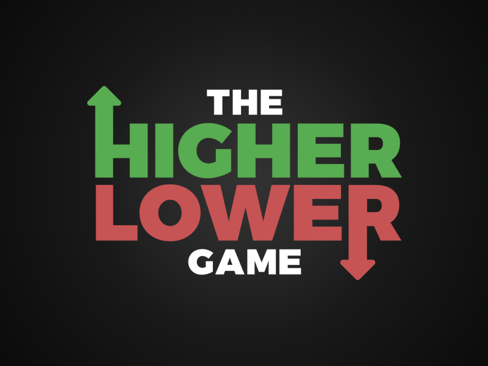

# Higher-Lower Game

A Python Bot that automates the Higher-Lower game

## Features

- Using json to store data
- Make sure no redundant data is added into the data file
- Ability to add a value that is not present in the data file
- Can restart the game if the gussing failed
- Using AdBlock extension
